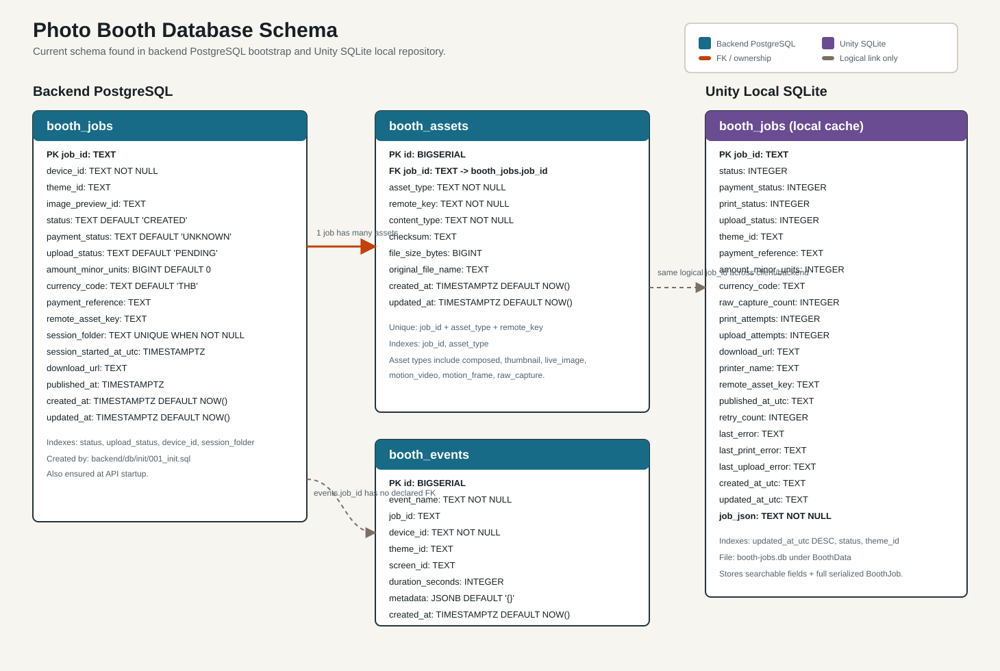

# Photo Booth DB Schema

Current database schema in this repository is split into two stores:

1. Backend PostgreSQL schema in `backend/db/init/001_init.sql` and `backend/api/src/server.js`.
2. Unity local SQLite cache schema in `Assets/ARStickerBooth/Runtime/Persistence/SqliteLocalRepository.cs`.

Open the ERD image here:

## Backend PostgreSQL

### `booth_jobs`

Primary job/session record.

| Column | Type | Notes |
| --- | --- | --- |
| `job_id` | `TEXT` | Primary key |
| `device_id` | `TEXT` | Required booth/device id |
| `theme_id` | `TEXT` | Selected theme |
| `image_preview_id` | `TEXT` | Selected preview/frame id |
| `status` | `TEXT` | Default `CREATED` |
| `payment_status` | `TEXT` | Default `UNKNOWN` |
| `upload_status` | `TEXT` | Default `PENDING` |
| `amount_minor_units` | `BIGINT` | Default `0` |
| `currency_code` | `TEXT` | Default `THB` |
| `payment_reference` | `TEXT` | External payment reference |
| `remote_asset_key` | `TEXT` | Main uploaded asset key |
| `session_folder` | `TEXT` | Unique when not null |
| `session_started_at_utc` | `TIMESTAMPTZ` | Session start time |
| `download_url` | `TEXT` | Public download URL |
| `published_at` | `TIMESTAMPTZ` | Publish/link-ready time |
| `created_at` | `TIMESTAMPTZ` | Default `NOW()` |
| `updated_at` | `TIMESTAMPTZ` | Default `NOW()` |

Indexes: `status`, `upload_status`, `device_id`, unique partial index on `session_folder`.

### `booth_assets`

Uploaded/generated files belonging to a job.

| Column | Type | Notes |
| --- | --- | --- |
| `id` | `BIGSERIAL` | Primary key |
| `job_id` | `TEXT` | FK to `booth_jobs.job_id`, cascades delete |
| `asset_type` | `TEXT` | Examples: `composed`, `thumbnail`, `live_image`, `motion_video`, `motion_frame`, `raw_capture` |
| `remote_key` | `TEXT` | File key/path under uploads root |
| `content_type` | `TEXT` | MIME type |
| `checksum` | `TEXT` | SHA-256 when available |
| `file_size_bytes` | `BIGINT` | Upload size |
| `original_file_name` | `TEXT` | Original uploaded file name |
| `created_at` | `TIMESTAMPTZ` | Default `NOW()` |
| `updated_at` | `TIMESTAMPTZ` | Default `NOW()` |

Constraints: unique `(job_id, asset_type, remote_key)`.
Indexes: `job_id`, `asset_type`.

### `booth_events`

Analytics/event log from booth clients.

| Column | Type | Notes |
| --- | --- | --- |
| `id` | `BIGSERIAL` | Primary key |
| `event_name` | `TEXT` | Event name |
| `job_id` | `TEXT` | Optional job id, no FK declared |
| `device_id` | `TEXT` | Required booth/device id |
| `theme_id` | `TEXT` | Optional theme |
| `screen_id` | `TEXT` | Optional screen |
| `duration_seconds` | `INTEGER` | Optional duration |
| `metadata` | `JSONB` | Default `{}` |
| `created_at` | `TIMESTAMPTZ` | Default `NOW()` |

Indexes: `event_name`, `job_id`, `device_id`, `created_at DESC`.

## Unity Local SQLite

### `booth_jobs`

Local cache table stored in `booth-jobs.db`. It mirrors important searchable fields and stores the complete serialized `BoothJob` object in `job_json`.

| Column | Type | Notes |
| --- | --- | --- |
| `job_id` | `TEXT` | Primary key |
| `status` | `INTEGER` | `BoothJobStatus` enum value |
| `payment_status` | `INTEGER` | `BoothPaymentStatus` enum value |
| `print_status` | `INTEGER` | `BoothPrintStatus` enum value |
| `upload_status` | `INTEGER` | `BoothUploadStatus` enum value |
| `theme_id` | `TEXT` | Selected theme |
| `payment_reference` | `TEXT` | Payment reference |
| `amount_minor_units` | `INTEGER` | Payment amount |
| `currency_code` | `TEXT` | Currency |
| `raw_capture_count` | `INTEGER` | Number of captured raws |
| `print_attempts` | `INTEGER` | Print retry count |
| `upload_attempts` | `INTEGER` | Upload retry count |
| `download_url` | `TEXT` | Public download URL |
| `printer_name` | `TEXT` | Printer name |
| `remote_asset_key` | `TEXT` | Main remote asset key |
| `published_at_utc` | `TEXT` | Publish/link-ready time |
| `retry_count` | `INTEGER` | General retry count |
| `last_error` | `TEXT` | Last general error |
| `last_print_error` | `TEXT` | Last print error |
| `last_upload_error` | `TEXT` | Last upload error |
| `created_at_utc` | `TEXT` | Created time |
| `updated_at_utc` | `TEXT` | Updated time |
| `job_json` | `TEXT` | Full serialized `BoothJob` |

Indexes: `updated_at_utc DESC`, `status`, `theme_id`.

